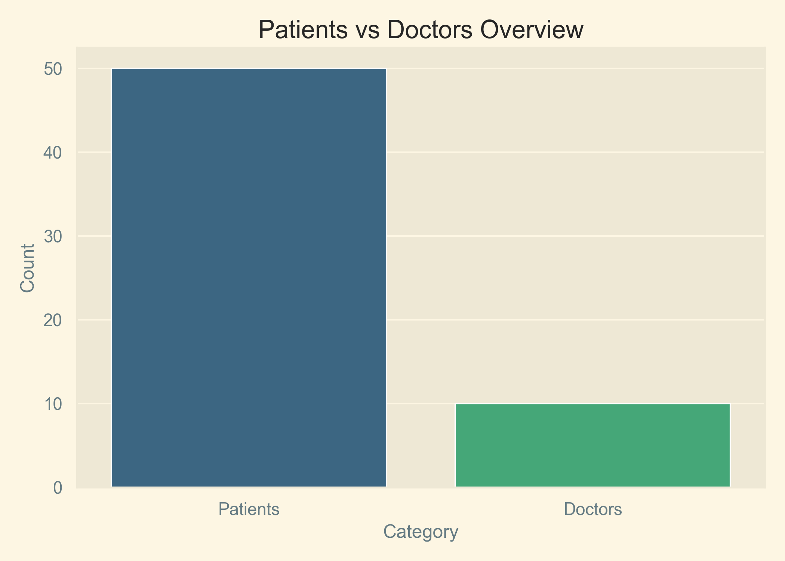
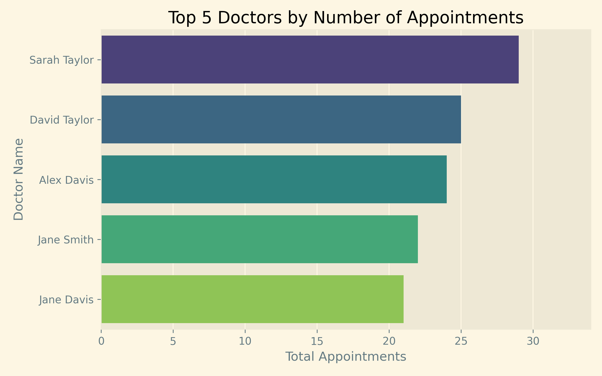
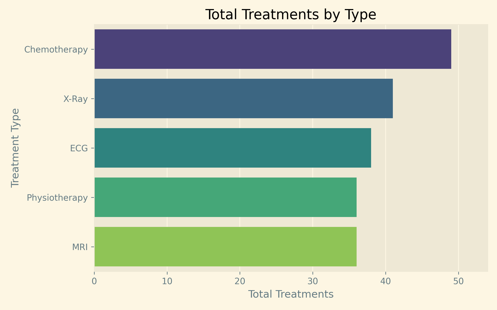
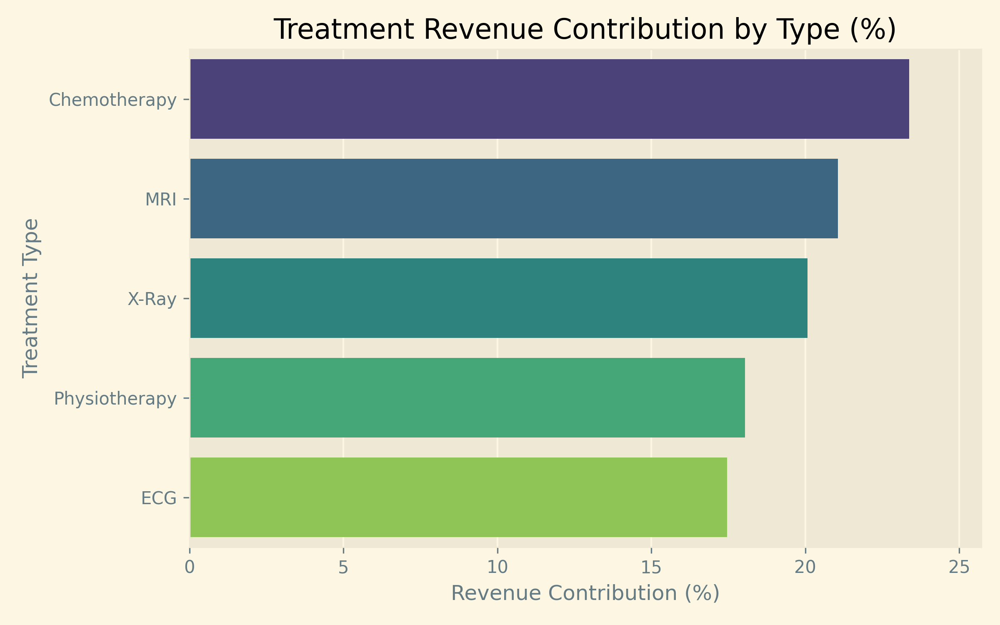
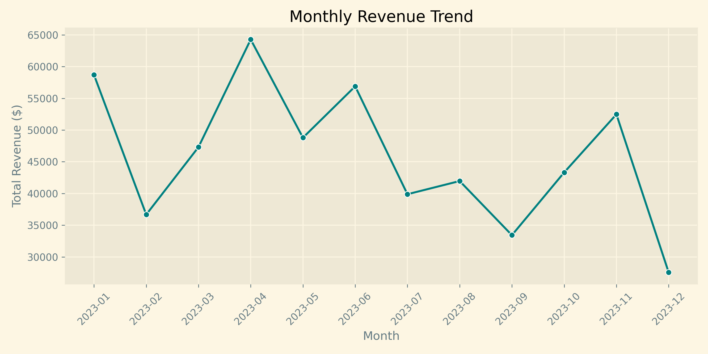
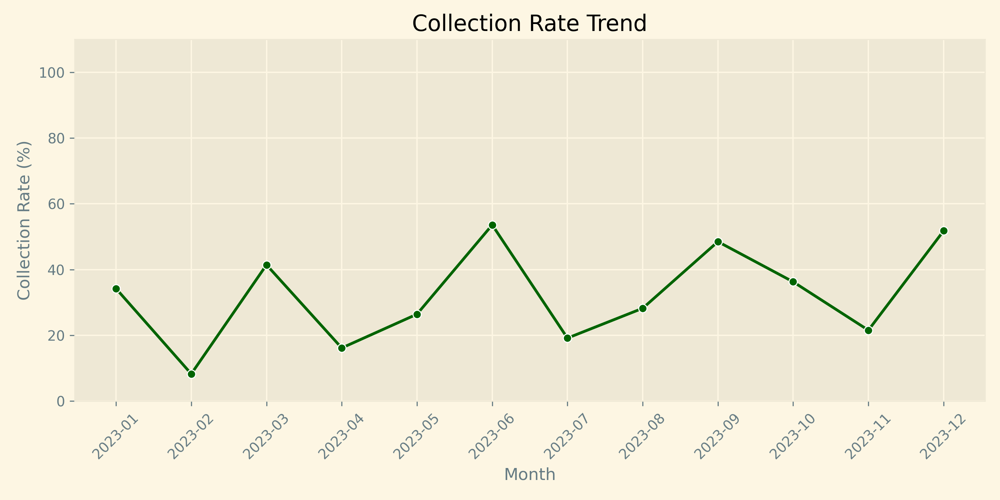
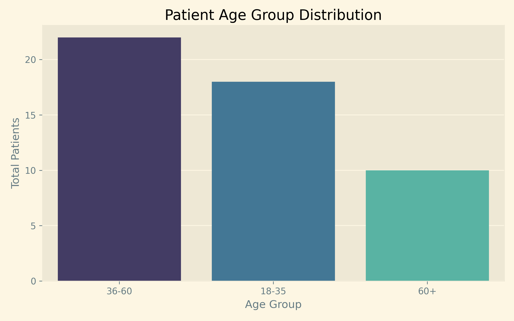
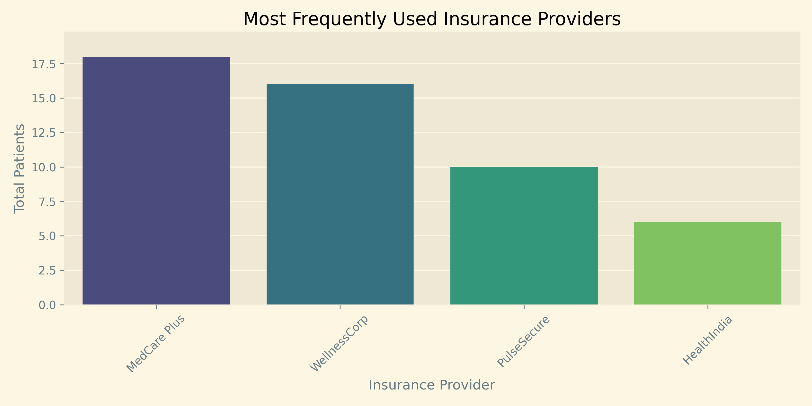

# 🏥 Hospital Operations & Revenue Cycle Report (2023)

## Table of Contents
- Data Source
- Overview
- Operational Deep-Dive
- Financial Health & RCM
- Patient Demographics
- Strategic Recommendations
- Conclusion

**Data Source:** Hospital Management Dataset, by Kanak Baghel on Kaggle.  
License: [CC BY-SA 4.0](https://creativecommons.org/licenses/by-sa/4.0/)  
*Analysis Pipeline: CSV → SQLite → Python (Pandas/Plotly) → Streamlit Dashboard.*
*Notebook lineage: `notebooks/Hospital_Performance_Analysis.ipynb` is the canonical portfolio version, while `notebooks/archive/project.ipynb` is retained as an archive reference.*

---

## Overview
This report evaluates hospital performance across operations, treatment delivery, and billing outcomes for 2023. While demand and billed revenue are strong, the **31.5% collection efficiency** is the primary financial risk identified. The findings highlight where workload balancing and payment follow-up can improve cash flow without expanding scale.

### Key Performance Indicators (KPIs)

| Metric | Value |
|:---|:---|
| **Total Registered Patients** | 50 |
| **Total Registered Doctors** | 10 |
| **Total Appointments** | 200 |
| **Gross Billed Revenue** | **$551,250** |
| **Collection Efficiency** | **31.5%** |

**Analysis:** The facility operates at a moderate scale but faces critical revenue cycle challenges. Only about one-third of the billed revenue has been collected, pointing to significant leaks in the billing and payment follow-up processes.

---

## Operational Deep-Dive

### Clinic Scale and Workload
- **Average appointments per doctor:** 20
- **Doctor-to-patient ratio:** 1:5

**Analysis:** Appointment distribution is highly uneven. Certain doctors handle much higher caseloads, creating potential bottlenecks. For instance, **Sarah Taylor** (29 appointments) and **David Taylor** (25 appointments) are significantly more utilized than others.

**Visuals:** - Patients vs Doctors Overview:  
  

- Top Doctors by Appointment Count:  

---

### Treatment Mix and Revenue Contribution

**Most Frequent Treatments:** - **Chemotherapy:** 49 cases
- **X-Ray:** 41 cases
- **MRI:** 36 cases

**Financial Impact by Treatment:** Revenue is concentrated in high-cost procedures. **MRI** and **Physiotherapy** lead in average cost per treatment, suggesting these service lines are critical for financial stability.

**Visuals:** - Treatment Frequency:  
  

- Treatment Revenue Contribution:  

---

## Financial Health & RCM

### Billing and Collections Deep-Dive
The analysis of payment statuses shows a worrying trend in non-realized revenue:
- **Completed Payments:** $173,425
- **Pending/Failed Payments:** ~$377,825

**Analysis:** The **31.5% collection rate** is inconsistent month-to-month, fluctuating between 8% and 53%. This emphasizes the need for a more structured Revenue Cycle Management (RCM) strategy.

**Visuals:** - Monthly Revenue Realization:  
  

- Collection Rate Trend:  

---

## Patient Demographics

- **Gender Distribution:** 31 males, 19 females.
- **Core Demographic:** Middle-aged patients (36–60 years) form the largest group.
- **Insurance Landscape:** Coverage is concentrated in **MedCare Plus** and **WellnessCorp**, which simplifies billing but increases dependency on these specific payers.

**Visuals:** - Age Groups:  
  

- Insurance Provider Breakdown:  

---

## Strategic Recommendations

1. **Revenue Cycle Optimization:** Implement an automated tracking system for **"Failed"** and **"Pending"** payments to recover the outstanding $378K.
2. **Workload Rebalancing:** Redistribute routine appointments away from high-volume doctors like Sarah Taylor to underutilized staff.
3. **Payer Strategy:** Negotiate better terms or diversify the insurance mix to reduce dependency on the top two providers.
4. **Patient Engagement:** Focus on the 36-60 age demographic with specialized health packages for high-revenue treatments like MRI and Oncology.

## Conclusion  
The hospital shows strong clinical demand and high revenue potential. However, the **operational success is currently decoupled from financial health.** By addressing the 31.5% collection efficiency and balancing physician workloads, the facility can dramatically improve its bottom line using existing resources.

---
**End of Report**